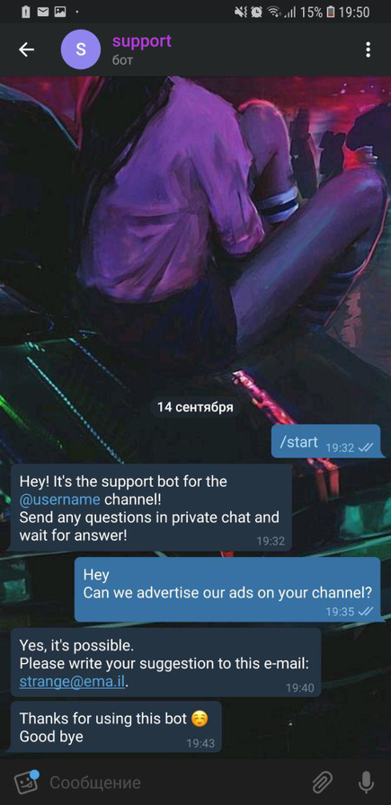

# support-bot
Telegram bot that helps to admins to communicate with subscribers.
It forwards messages from subscribers to admin's chat and sends answers to user from admins.

Users' chat:



Admins' chat:


## Usage

### Configuration

Edit `config.ini` file to run the bot.

Necessary:
  * `token` is your telegram bot's token.
  * `support-chat-id` is id of chat with admin(-s). If you want to use it alone write id of your account.

All messages are editable.
You can find them in config file too.

#### Proxy

You can use https proxy for bot.

Change `proxy` to `yes` and write your address in `proxy-server`.
```
proxy-server: https://server_address:port
```

#### Receiving types

You can filter user's files types.
Write in `forward-types` variable all necessary types from telegram bot api.

### Running

There are many ways to run the bot.

It's running in docker and installing packages using pipenv or pip.

#### Docker

```bash
docker build -t support-bot .  # build
docker run \
  -p 6379:6379 \  # or another ports that you use for redis
  --network host \
  --rm \
  support-bot
```
Dockerfile is existing in project folder.

#### Pipenv

```bash
pipenv install -r requirements.txt  # install packages
pipenv run python main.py  # run
```

#### Standard

```bash
pip install -r requirements.txt  # install packages
python main.py
```
Be sure that you are using python3
